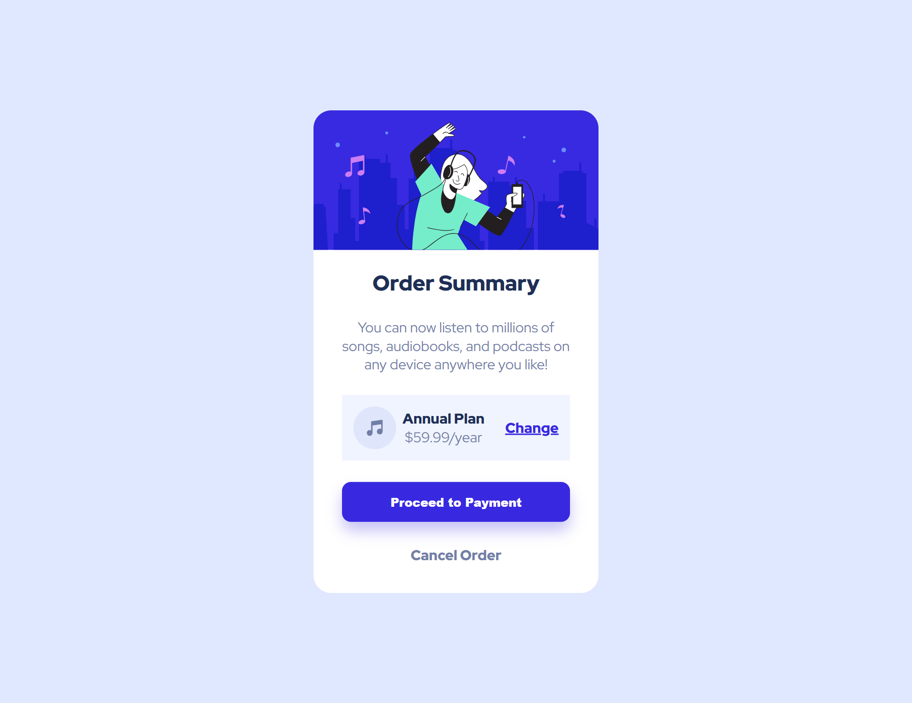

# Order Summary Component

This is a solution for the **Order Summary Component** challenge from [Frontend Mentor](https://www.frontendmentor.io/).

## 🖥️ Live Preview

[Click here to view the live project](https://telmomanduco.github.io/order-summary-component-main/
)

## 📂 Project Overview

A simple and clean order summary card built with HTML and CSS. The layout is fully responsive and includes:
- A hero image
- Plan details with price
- Change plan link
- Payment button
- Cancel order link

## 🛠️ Built With

- HTML5
- CSS3
- Flexbox
- Mobile-first workflow
- Google Fonts (Red Hat Display)

## 📸 Screenshots

## ✍️ Author

- GitHub: [@TelmoManduco](https://github.com/TelmoManduco)
- Frontend Mentor: [@TelmoManduco](https://www.frontendmentor.io/profile/TelmoManduco)

---

Thanks for checking out my project!
